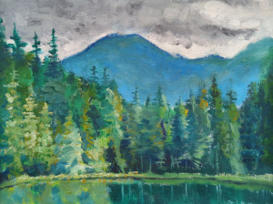

[ 
Mandalorian](mandalorian.jpg)

[ 
Koi fish](koi.jpg)

[ 
Cloudy forest](cloudy-forest.jpg)

[ 
Apples](apples.jpg)

[ 
Desert plant](desert-plant.jpg)

[ 
Giraffe](giraffe.jpg)

[ 
Sitting tiger](sitting-tiger.jpg)

[ 
Tiger](tiger.jpg)

[ 
Seal](seal.jpg)

[ 
Surfer](surfer.jpg)

